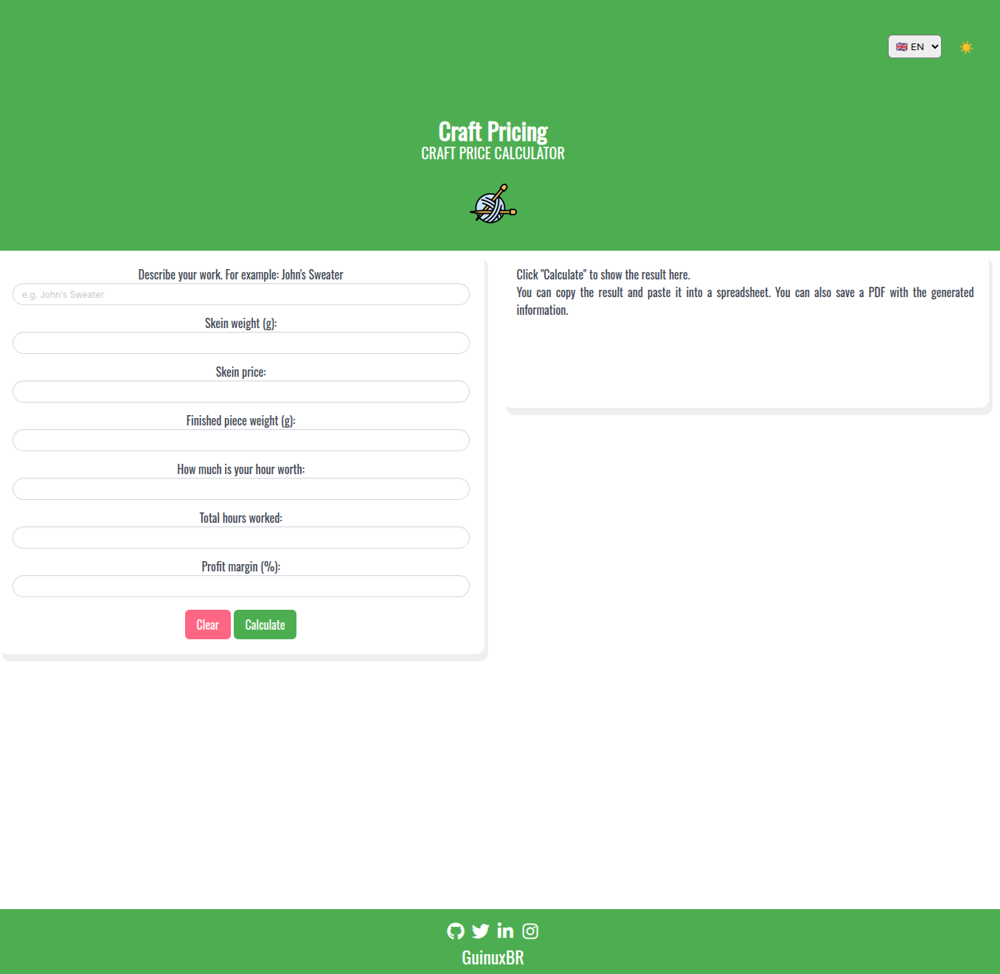

# Craft Pricing

This simple app, written in HTML, CSS, and JavaScript, helps you calculate the price to charge for a craft project.

I made this for my mum! 😁❤️

Available at <http://craftpricing.guinuxbr.com>

## Screenshot

## Prerequisites

There are no prerequisites. Just browse the URL and use it!

## Using Craft Pricing

Just browse to: <https://craftpricing.guinuxbr.com>

## Contributing to Craft Pricing

To contribute to craft Pricing, follow these steps:

1. Fork this repository.
2. Create a branch: `git checkout -b <branch_name>`.
3. Make your changes and commit them: `git commit -m '<commit_message>'`
4. Push to the original branch: `git push origin craft-pricing/<location>`
5. Create the pull request.

Alternatively, see the GitHub documentation on [creating a pull request](https://help.github.com/en/github/collaborating-with-issues-and-pull-requests/creating-a-pull-request).

## Maintainer & Contributors

* [@guinuxbr](https://github.com/guinuxbr)

## Contact

If you want to contact me you can email <guinuxbr@gmail.com>.

## Licence

This project uses the following licence: [MIT](LICENSE).
